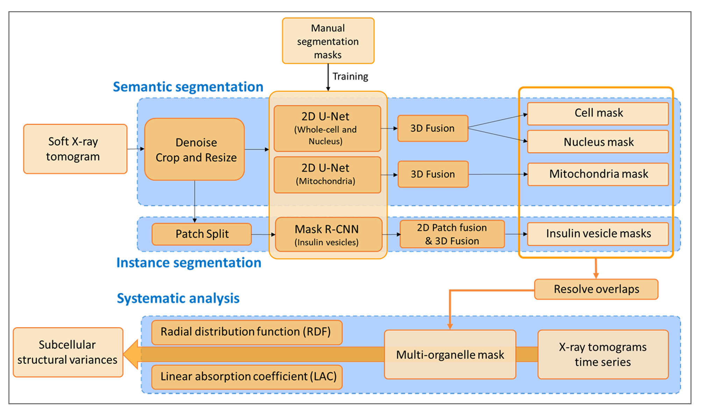

# Cell-Segmentation
Official Implementation of [Auto-Segmentation and Time-Dependent Systematic Analysis of Mesoscale Cellular Structure in β-Cells During Insulin Secretion]().


## Description of folders
dataloaders: scripts for preprocessing input data, data augmentation.  
experiments: scripts for evaluating semantic results: cell/nucleus/mitochondria.  
figure: the workflow figure for this paper.  
networks: framework structure of unet.  
script: commands to run model on test data.  


## Cell IDs
Partition of training/validation/testing: 18/3/3

Training set: 766_10, 766_11, 766_2, 766_7, 769_5, 769_7, 783_12 783_6, 784_4, 784_6, 784_7, 785_7, 822_4, 822_6, 822_7, 842_13, 931_14, 931_9,   
Validation set: 766_5, 783_5, 842_12,  
Testing set: 766_8, 784_5, 842_17,  

## Installation

### Dependencies
* Python 3.7.3
* PyTorch 1.3.1
* torchvision 0.4.2
* Cuda version 10.0




## Get Started
```
git clone https://github.com/Xiangyi1996/Cell-Segmentation.git
cd Cell-Segmentation
mkdir logs
mkdir data
mkdir results
```

### Data Preparation for Soft X-ray tomograms (SXT) Dataset
**1. Download SXT dataset from PBC**

Please go to [PBC Dataset](https://pbcconsortium.isrd.isi.edu/) and download [SXT images](https://drive.google.com/drive/folders/1ReftAgqdNtjqm5ZKe2rkoTYWYfz-s5vb?usp=sharing) and [manual labels](https://drive.google.com/drive/folders/1DCPRYQXFNRHMd5FFDtTr81hclttLgfC_?usp=sharing), and put them under data folder.
```
# symlink the pascal dataset
cd data
ln -s /path_to_sxt_images/ ./image_xyz
ln -s /path_to_manual_labels/ ./mask_xyz
```

**2. Download pretrained model**
Download the [FS_mito](https://drive.google.com/file/d/1RCwETRuUYfAURD8XXJ1RQVGOTIQavQuE/view?usp=sharing) 
and [FS_mem_nu](https://drive.google.com/file/d/1TRk_AWms32EFG-sqhfd4q4Td3ptmlxEp/view?usp=sharing)
weights and put them under ./results folder.
```
# download the pretrained model
cd results
mkdir FS_mito
mkdir FS_mem_nu
```

### Inference in Command Line for test data
```
# Test mitochondria model 
sh script/test_mito.sh

# Test membrane and nuclear model
sh script/test_mem_nu.sh
```
There are some hyperparameters that you can adjust in the script.

```
python test/eval_mito.py --gpu 0 --exp FS_mito --num-workers 8 --batch-size 1 --num-classes 4 --test_idx 'iso'
```
PS: You can change the ```EXP``` in script to your pretrained model name. The above is just an example.

## Results
We list the performance w/o 3D fusion.
|   Before 3D fusion | Membrane |  Nucleus  | Mito |    
|:-----------------------:|:--------------------------------------------------:|:--------------------------------------------------:|:--------------------------------------------------:|
| 766_8 | 90.74| 93.21| 68.58| 
| 784_5 | 87.43| 89.95| 63.17|
| 842_17 | 85.34| 83.50| 65.03||
| mean | **87.84** | **88.89**| **65.59** |

|    After 3D fusion | Membrane |  Nucleus  | Mito |
|:-----------------:|:-----------------:|:-----------------:|:-----------------:|
| 766_8 |93.54           |  93.92  |70.34 | 
| 784_5 | 89.41            |  91.82  | 67.29|
| 842_17 | 91.85      |  89.49  |67.40|
| mean |**91.60** |  **91.74**  |**68.34**|

## RDF Results
And the RDF of our results can be downloaded [here](https://drive.google.com/file/d/13kPjGTrzVUX43bJwBVLtZRaWDYUok9rZ/view?usp=sharing) 

<!-- ## Citation
Please consider citing our paper if the project helps your research. BibTeX reference is as follows.
```
@article{liu2020part,
  title={Part-aware Prototype Network for Few-shot Semantic Segmentation},
  author={Liu, Yongfei and Zhang, Xiangyi and Zhang, Songyang and He, Xuming},
  journal={arXiv preprint arXiv:2007.06309},
  year={2020}
}
```

## References
Part of our code are based on [PANet](https://github.com/kaixin96/PANet)
 -->
